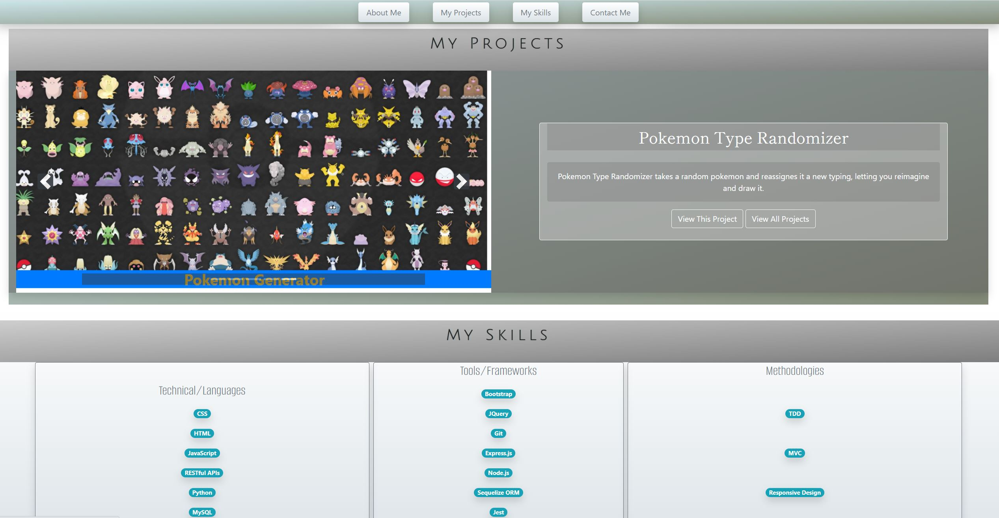

# Testname
  ## Description
  Test

  ## License
  

  ## Table of Contents
  1. [Installation](#Installation)
  2. [Deployment](#Deployment)
  3. [Usage](#Usage)
  4. [Screenshot](#Screenshot)
  5. [Contributing](#Contributing)
  6. [Technologies](#Technologies)
  7. [Tests](#Tests)
  8. [Questions](#Questions)

  ## Installation
  No installation is required to run this project.  View the 'Deployment' section to find the link to the site.

  ## Deployment
  undefined

  ## Usage
  test

  ## Screenshot
  

  ## Contributing
  Please feel free to contact me if you have questions about contributing to this project.  Ypu can reach out via my email or GirHub account linked below.

  ## Technologies
  * CSS
  * HTML
  * Javascript
  * Node.js

  ## Tests
  No testing frameworks were used in the development of this project, and it does not contain test files.

  ## Questions
  [Check out my GitHub](https://github.com/d)
  --or--
  Email me at d
